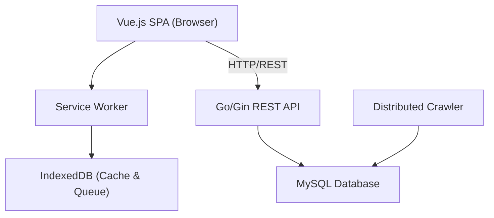
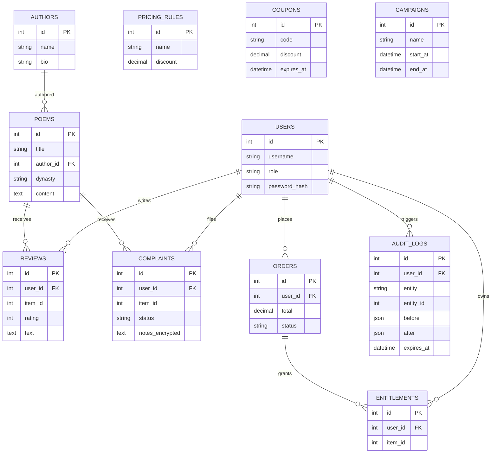

# System Design for Helios Cultural Content & Operations Management System

## 1. System Architecture

- **Frontend**: Vue.js SPA, offline support (service worker, IndexedDB), network-state indicators, queued actions drawer, resumable downloads.
- **Backend**: Gin (Go) REST API, RBAC, session management, audit log, approval workflow, encrypted storage for sensitive data.
- **Database**: MySQL (content, pricing, orders, reviews, complaints, audit logs, etc.)
- **Crawler**: Distributed, elastic scheduling, checkpointed resume, per-host rate limits, job quotas, retry/backoff, metrics.
- **Local Storage**: Client-side cache, persistent retry queue, crash logs for admin review.

## 2. Key UI/UX Flows

- **Search & Browse**: Filters (keyword, author, dynasty, tag, meter), suggestions, keyword highlighting, synonym toggle, offline access.
- **Pricing & Checkout**: Discount stacking, coupon entry, price explanation, member pricing.
- **Review/Complaint**: Star ratings, free text, status tracking, arbitration.
- **Admin Console**: Bulk edit, approval queue, audit log, rollback, campaign/coupon management.

## 3. Data Model (ERD Overview)

- **Users**: id, username, role, password_hash, ...
- **Poems**: id, title, author_id, dynasty, content, ...
- **Authors**: id, name, bio, ...
- **Reviews**: id, user_id, item_id, ratings, text, ...
- **Complaints**: id, user_id, item_id, status, notes_encrypted, ...
- **PricingRules, Coupons, Campaigns, Orders, Entitlements, AuditLogs, etc.**

## 4. State & Workflow Diagrams (Textual)

- **Offline/Online State**: online → offline (cache, queue writes) → online (sync queued actions)
- **Approval Workflow**: edit → pending → approved/rejected/auto-revert
- **Queue Processing**: pending → sent → confirmed/failed

## 5. Security & Compliance

- Passwords: salted & hashed
- Sensitive notes: encrypted at rest
- Session: 30 min idle timeout
- Audit: before/after diffs, rollback, admin sign-off for critical actions

---

## 6. Architecture Diagram

## 7. ERD (Entity Relationship Diagram)

